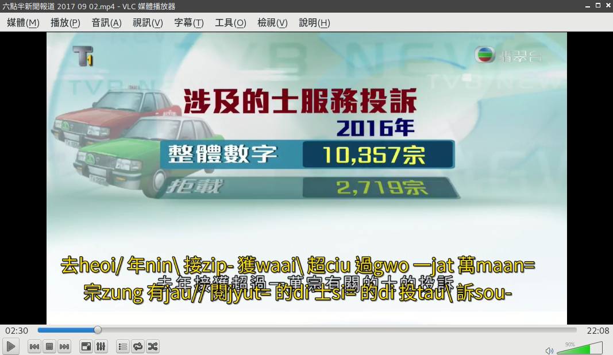

# 粵拼字幕生成工具

## 簡介

此 Python Script 可用於給 TVB 的電視節目增加粵拼字幕，目前尚在 Experimental 階段。開源授權條款寫在程式檔案中。



現在的效果一般，時間軸稍有偏差，OCR 有不少錯字，多音字也沒辦法處理。不過到這種程度就已經很有用了，借用一句名言就是「不滿意但可以接受」。

圖形處理和 OCR 的部分，是由 OpenCV 和 pyocr 完成的。由於本人對這些方面並不太了解，所以這部分借用的是 kerrickstaley 的程式，原程式見：[kerrickstaley/extracting-chinese-subs](https://github.com/kerrickstaley/extracting-chinese-subs)

## 使用方法

```
usage: jyutping.py [-h] [--top TOP] [--bottom BOTTOM] [--left LEFT]
                   [--right RIGHT]
                   video_file
```
其中 top, bottom, left, right 是包住字幕的矩形的邊界，若搞錯則得不到任何文字。默認的數字是以 1280×720 大小的影片為準的。

運行後，程式會向 stderr 輸出進度資訊，併在 stdout 輸出 .srt 檔的內容，因此使用時請重定向 stdout 到檔案。

例如：

```
$ ./jyutping.py foobar.mp4 > foobar.srt
```

## 這麽粗製濫造真的大丈夫？

講真，為了學個廣東話去深入學習 OpenCV / Image Processing 實在是主次顛倒，所以就先這樣吧。而且最近不大想寫程式了，心累。